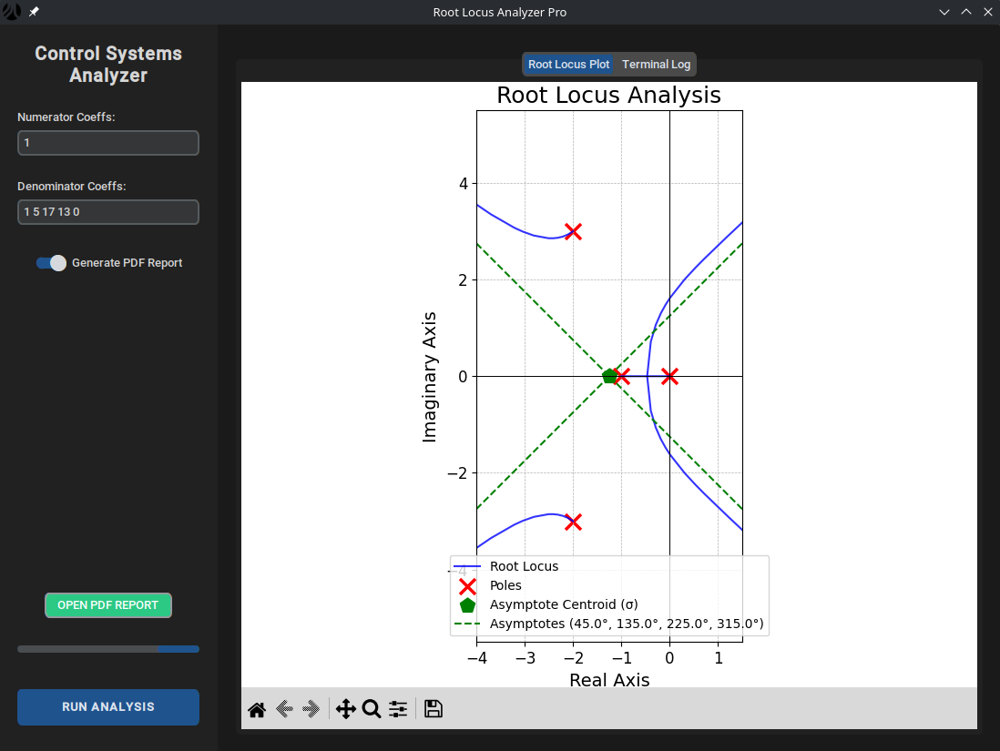

# Root Locus Analyzer

The **Root Locus Analyzer** is a Control Systems Engineering tool developed in Python. It provides an interactive environment to analyze transfer functions, visualize Root Locus plots, calculate stability parameters (Routh-Hurwitz), and automatically generate detailed engineering reports in PDF format.



## Table of Contents

- [About the Project](#about-the-project)
  - [Features](#features)
  - [Repository Structure](#repository-structure)
- [Installation & Downloads](#installation--downloads)
  - [Executable (No Python Required)](#executable-no-python-required)
  - [Prerequisites (LaTeX)](#prerequisites-latex)
- [Development](#development)
  - [Running from Source](#running-from-source)
  - [Building the Executable](#building-the-executable)
- [Usage](#usage)
- [Tech Stack](#tech-stack)
- [License](#license)
- [Author](#author)

## About the Project

This tool was designed to streamline the analysis of control systems by combining numerical computation with automated documentation.

### Features

* **Interactive GUI:** Modern dark-mode interface built with `CustomTkinter`.
* **Root Locus Plotting:** High-precision visualization using `Matplotlib` and `Control`.
* **Automatic Analysis:**
    * Poles and Zeros calculation.
    * Asymptote centroid ($\sigma$) and angles.
    * Breakaway/Break-in points ($dK/ds = 0$).
    * Imaginary axis crossing (Routh-Hurwitz Criterion).
    * Departure and Arrival angles.
* **PDF Reporting:** Generates professional LaTeX reports containing mathematical derivations and plots.
* **Cross-Platform:** Native support for Windows and Linux.

([back to top](#table-of-contents))

### Repository Structure

This repository is organized into logical components covering source code, build tools, and assets.

- [`src/`](./src/): Core Python source code (`interface.py`, `root_locus_analyzer.py`).
- [`build_scripts/`](./build_scripts/): Scripts for freezing the app with PyInstaller (Windows/Linux).
- [`assets/`](./assets/): Icons and static resources.
- [`gui_plots/`](./gui_plots/): Directory for temporary plot generation.
- [`dist/`](./dist/): Output directory for compiled binaries.

([back to top](#table-of-contents))

## Installation & Downloads

### Executable (No Python Required)

You do not need to install Python to run this application.

1.  Navigate to the **[Releases](../../releases)** tab.
2.  Locate the latest tag (e.g., `v1.0.0`).
3.  Download the binary for your OS:
    * **Windows:** `RootLocus_Windows.exe`
    * **Linux:** `RootLocus_Linux`

### Prerequisites (LaTeX)

**Important:** To use the **"Generate PDF Report"** feature, a LaTeX distribution is required. The software relies on `pdflatex` to compile the report.

**Windows Users:**
Download and install **MiKTeX**. Ensure you enable "Install missing packages on-the-fly" during setup.
* Download: [miktex.org/download](https://miktex.org/download)

**Linux Users:**
Install a TeX Live distribution via your package manager.
* Arch Linux: `sudo pacman -S texlive-meta`
* Ubuntu/Debian: `sudo apt-get install texlive-full`

> **Note:** Without LaTeX, the on-screen analysis and plotting will function normally, but PDF generation will fail.

([back to top](#table-of-contents))

## Development

Instructions for running the raw Python code or contributing to the project.

### Running from Source

1.  **Clone the repository:**
    ```bash
    git clone [https://github.com/lucio-mario/root_locus.git](https://github.com/lucio-mario/root_locus.git)
    cd root_locus
    ```

2.  **Set up the environment:**
    ```bash
    python -m venv venv
    source venv/bin/activate      # Linux
    # .\venv\Scripts\activate     # Windows
    ```

3.  **Install dependencies:**
    ```bash
    pip install -r requirements.txt
    ```

4.  **Run:**
    ```bash
    python src/interface.py
    ```

## Building the Executable

To compile the source code into a standalone executable (freezing the application), use the provided scripts in the `build_scripts` directory. This uses **PyInstaller**.

### On Linux
```bash
chmod +x build_scripts/build_linux.sh
./build_scripts/build_linux.sh
```

* The binary will be located in `dist/RootLocus_Linux`.

### On Windows

Double-click `build_scripts\build_windows.bat` or run via CMD:

```bash
build_scripts\build_windows.bat
```

* The executable will be located in `dist\RootLocus_Windows.exe`.

([back to top](#table-of-contents))

## Usage

1.  Launch the application.
2.  **Numerator Coeffs:** EEnter space-separated coefficients (e.g., `1` for numerator $1$, or `1 2` for $s+2$).
3.  **Denominator Coeffs:** Enter space-separated coefficients (e.g., `1 3 2` for $s^2 + 3s + 2$).
4.  Toggle **Generate PDF Report** if you want the documentation (requies LaTeX).
5.  Click **RUN ANALYSIS**.
6.  View the plots in the **Root Locus Plot** tab or read the logs in **Terminal Log**.
7. If successful, the **OPEN PDF REPORT** button will become active.

([back to top](#table-of-contents))

## Tech Stack

* **GUI:** `customtkinter`
* **Math & Control:** `numpy`, `scipy`, `control`, `sympy`
* **Plotting:** `matplotlib`
* **Reporting:** `pylatex`
* **Build:** `pyinstaller`, `github actions`

([back to top](#table-of-contents))

## License

This project is released under the **MIT License**.
See the [`LICENSE`](./LICENSE) file for details.

([back to top](#table-of-contents))

## Author

Developed by **Lúcio Mário Barbosa da Silva Filho**
GitHub: [`@lucio-mario`](https://github.com/lucio-mario)

([back to top](#table-of-contents))
